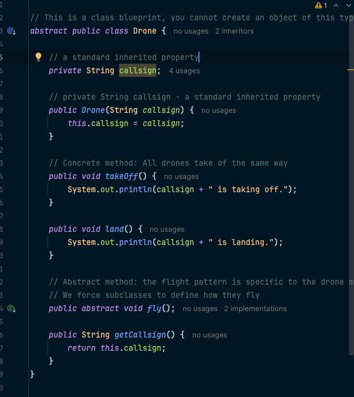

# JC-Exploring-Cadet-Training-Module

**Student Name:** Kayne Uriel Rodrigo

## Project Overview
This repository contains the implementation of a Java-based drone control system demonstrating inheritance and interfaces concepts. The project creates a flexible, modular system for managing different types of unmanned aerial drones with various capabilities.

## Project Structure

### 1. Abstract Base Class
- **Drone.java** - Abstract class defining core drone properties and behaviors

### 2. Interfaces
- **VisualRecon.java** - Interface for visual reconnaissance capabilities
- **SignalIntel.java** - Interface for signal intelligence capabilities  
- **AdvancedRecon.java** - Interface extending both VisualRecon and SignalIntel

### 3. Concrete Implementations
- **QuadCopter.java** - Concrete drone class implementing basic visual reconnaissance
- **FixedWingDrone.java** - Advanced drone class implementing multiple capabilities

### 4. Main Application
- **MissionControl.java** - Main class demonstrating the system functionality

## Key Java Concepts Demonstrated

### Inheritance
- Abstract classes with abstract and concrete methods
- Method overriding with `@Override` annotation
- Constructor chaining with `super()`

### Interfaces
- Abstract methods requiring implementation
- Default methods providing optional implementations
- Static methods for utility functions
- Interface constants (public static final)
- Interface extension (extending multiple interfaces)

### Object-Oriented Design
- Polymorphism through interface implementation
- Encapsulation of drone properties
- Modular capability design

## Expected Program Output

```
--- Deploying QuadCopter Unit ---
Bravo-1 is taking off.
Bravo-1 is hovering with four rotors.

--- Engaging Recon Capabilities ---
Bravo-1 takes a picture with its High-Resolution Optical Camera.
Recording 4K video using default settings.
Standard Lens Type: 50mm Standard Lens
Bravo-1 is landing.


--- Deploying Advanced Fixed-Wing Unit ---
Phoenix-7 is taking off.
Phoenix-7 is cruising at high altitude.
Phoenix-7 captures high-resolution satellite imagery.
Phoenix-7 intercepts and analyzes radio frequencies.
Engaging gimbal-stabilized 4K video recording.
Phoenix-7 is landing.
```

## Screenshots

### Drone.java - Abstract Base Class

*Abstract class defining core drone functionality with takeOff(), land(), and abstract fly() method*

### VisualRecon.java - Interface with Multiple Method Types

*Interface demonstrating abstract methods, default methods, static methods, and constants*

### QuadCopter.java - Basic Implementation

*Concrete implementation extending Drone and implementing VisualRecon interface*

### SignalIntel.java - Additional Capability

*Simple interface for signal intelligence capabilities*

### AdvancedRecon.java - Interface Extension

*Interface extending multiple other interfaces to create complex capability contracts*

### FixedWingDrone.java - Advanced Implementation

*Advanced drone implementing multiple interfaces with method overriding*

### MissionControl.java - Main Application

*Main class demonstrating system functionality and testing all implementations*

### Program Execution Output

*Console output showing the drone control system in action*

## How to Run

1. Compile all Java files:
   ```bash
   javac *.java
   ```

2. Run the main program:
   ```bash
   java MissionControl
   ```

## Learning Objectives Achieved

✅ Combined abstract classes and interfaces to create flexible class hierarchy  
✅ Created interfaces with abstract, static, and default methods  
✅ Implemented multiple interfaces in a single class  
✅ Created new interfaces that extend existing ones  
✅ Demonstrated proper inheritance and polymorphism principles

## Academic Integrity Declaration

This work was completed independently without the use of AI tools, chatbots, or automated systems. All code implementations are original and demonstrate understanding of Java inheritance and interface concepts as taught in the course materials.
